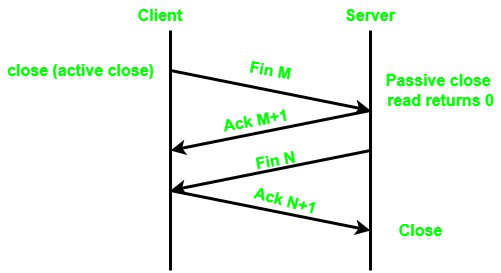
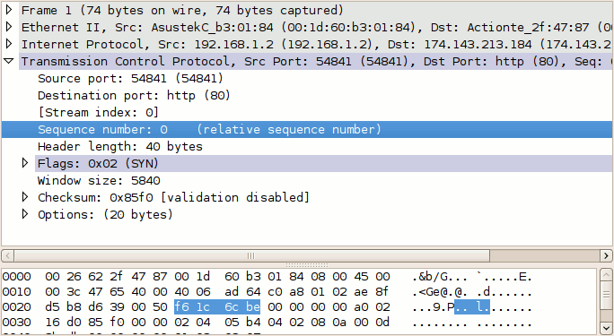
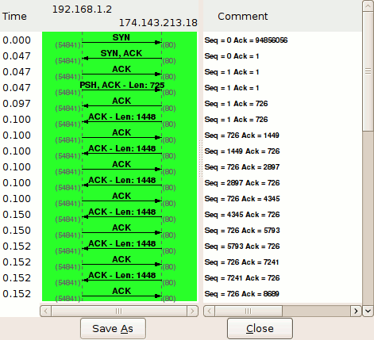
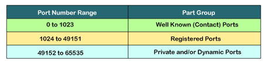

[wireshark.md](wireshark.md#sub-section)

#   
TCP-IP</centre>  
+   What are the differences between the OSI model and the TCP/IP model? 

**OSI Model TCP/IP** Model
It is developed by ISO (International Standard Organization) 	It is developed by ARPANET (Advanced Research Project Agency Network).
OSI model provides a clear distinction between interfaces, services, and protocols. 	TCP/IP doesn’t have any clear distinguishing points between services, interfaces, and protocols.
OSI refers to Open Systems Interconnection. 	TCP refers to Transmission Control Protocol.
OSI uses the network layer to define routing standards and protocols. 	TCP/IP uses only the Internet layer.
OSI follows a vertical approach. 	TCP/IP follows a horizontal approach.
OSI layers have seven layers. 	TCP/IP has four layers.
In the OSI model, the transport layer is only connection-oriented. A layer of the TCP/IP model is both connection-oriented and connectionless.
In the OSI model, the data link layer and physical are separate layers. In TCP, physical and data link are both combined as a single host-to-network layer.
Session and presentation layers are a part of the OSI model. 	There is no session and presentation layer in the TCP model.
It is defined after the advent of the Internet. 	It is defined before the advent of the internet.
The minimum size of the OSI header is 5 bytes. 	The minimum header size is 20 bytes.

+ How many layers do these two models have ?

+ What do the acronyms TCP and IP refer to ? 
    TCP: is one of the main protocols in TCP/IP networks. Whereas the IP protocol deals only with packets, TCP enables two hosts to establish a connection and exchange streams of data. TCP guarantees delivery of data and also guarantees that packets will be delivered in the same order in which they were sent. 
    
    IP:  The Internet Protocol, as defined in IETF RFC 6864, which is the principal communications protocol in the IETF Internet protocol suite for specifying system address information when relaying datagrams across network boundaries. 

    The IP, as defined in IETF RFC 6864, is the principal communications protocol in the IETF Internet protocol suite for specifying system address information when relaying datagrams across network boundaries 
+ List the different layers of the TCP/IP model.

 
TCP/IP LAYERS

    <ol>
        <li>Application Layer</li>
        <li>Transport Layer</li>  
        <li>Internet Layer</li>
        <li>Network Access Layer</li>
    </ol>  

+ Give some examples of protocols and indicate 
which one of TCP/IP model layer they refer to.
<table style="width:100%">
  <tr>
    <th>
Layer</th>
    <th>
Protocols</th>
  </tr>
  <tr>
    <td>
4</td>
    <td>
HTTP/RDP/SSH/SMTP</td> 
  <tr>
    <td>
3</td>
    <td>
TCP/UDP</td>
  </tr>
  <tr>
    <td>
2</td>
    <td>
(IP-v4/IP-v6)/ARP</td>
    
  </tr>
   <tr>
    <td>
1</td>
    <td>
ETHERNET/TOKEN RING</td>
    
  </tr>
</table> 

+ Explain how a connection gets established, in other words, explain the "3-way handshake" process?

 
3 way Handshake Diagram

Step 1: In the first step,	the client establishes a connection with a server. It sends a segment with SYN and informs the server about the client should start communication, and with what should be its sequence number.

Step 2: In this step server responds to the client request with SYN-ACK signal set. ACK helps you to signify the response of segment that is received and SYN signifies what sequence number it should able to start with the segments.

Step 3: In this final step, the client acknowledges the response of the Server, and they both create a stable connection will begin the actual data transfer process.

+ Explain how a connection is terminated, in other words, explain the "4-way disconnect" process?

to terminate an established TCP connection, the following 4 TCP packets are needed to be exchanged. Which you can understand with the statements below:

1. Host A → Host B: FIN flag set.
2. Host B → Host A: ACK flag set.
3. Host B → Host A: FIN flag set.
4. Host A → Host B: ACK flag set.

These 4 steps are known as a TCP 4-way handshake, which is necessary to terminate a TCP connection. For the termination of the established TCP connection, the following steps are necessary for the process. Which are given down below:

Firstly, from one side of the connection, either from the client or the server the FIN flag will be sent as the request for the termination of the connection.

In the second step, whoever receives the FIN flag will then be sending an ACK flag as the acknowledgment for the closing request to the other side.

And, at the Later step, the server will also send a FIN flag as the closing signal to the other side.
In the final step, the TCP, who received the final FIN flag, will be sending an ACK flag as the final Acknowledgement for the suggested connection closing.

For a better understanding, you can take a look at the diagram below:

+ Explain what are the "sequence number" and "acknowledgment number" in TCP.

The client on either side of a TCP session maintains a 32-bit sequence number it uses to keep track of how much data it has sent. This sequence number is included on each transmitted packet, and acknowledged by the opposite host as an acknowledgement number to inform the sending host that the transmitted data was received successfully.

When a host initiates a TCP session, its initial sequence number is effectively random; it may be any value between 0 and 4,294,967,295, inclusive. However, protocol analyzers like Wireshark will typically display relative sequence and acknowledgement numbers in place of the actual values. 
These numbers are relative to the initial sequence number of that stream. This is handy, as it is much easier to keep track of relatively small, predictable numbers rather than the actual numbers sent on the wire.

For example, the initial relative sequence number shown in packet #1 is 0 (naturally), while the ASCII decode in the third pane shows that the actual sequence number is 0xf61c6cbe, or 4129057982 decimal.

To better understand how sequence and acknowledgement numbers are used throughout the duration of a TCP session, we can utilize Wireshark's built-in flow graphing ability. Navigate to Statistics > Flow Graph..., select TCP flow and click OK. 
Wireshark automatically builds a graphical summary of the TCP flow.

We can use this flow graph to better understand how sequence and acknowledgement numbers work.

Packet #1

Each side of a TCP session starts out with a (relative) sequence number of zero. Likewise, the acknowledgement number is also zero, as there is not yet a complementary side of the conversation to acknowledge.

(Note: The version of Wireshark used for this demonstration, 1.2.7, shows the acknowledgement number as an apparently random number. This believed to be a software bug; the initial acknowledgement number of a session should always be zero, as you can see from inspecting the hex dump of the packet.)

Packet #2

The server responds to the client with a sequence number of zero, as this is its first packet in this TCP session, and a relative acknowledgement number of 1. The acknowledgement number is set to 1 to indicate the receipt of the client's SYN flag in packet #1.

Notice that the acknowledgement number has been increased by 1 although no payload data has yet been sent by the client. This is because the presence of the SYN or FIN flag in a received packet triggers an increase of 1 in the sequence. (This does not interfere with the accounting of payload data, because packets with the SYN or FIN flag set do not carry a payload.)

Packet #3

Like in packet #2, the client responds to the server's sequence number of zero with an acknowledgement number of 1. The client includes its own sequence number of 1 (incremented from zero because of the SYN).

At this point, the sequence number for both hosts is 1. This initial increment of 1 on both hosts' sequence numbers occurs during the establishment of all TCP sessions.

Packet #4

This is the first packet in the stream which carries an actual payload (specifically, the client's HTTP request). The sequence number is left at 1, since no data has been transmitted since the last packet in this stream. The acknowledgement number is also left at 1, since no data has been received from the server, either.

Note that this packet's payload is 725 bytes in length.

Packet #5

This packet is sent by the server solely to acknowledge the data sent by the client in packet #4 while upper layers process the HTTP request. Notice that the acknowledgement number has increased by 725 (the length of the payload in packet #4) to 726; e.g., "I have received 726 bytes so far." The server's sequence number remains at 1.

Packet #6

This packet marks the beginning of the server's HTTP response. Its sequence number is still 1, since none of its packets prior to this one have carried a payload. This packet carries a payload of 1448 bytes.

Packet #7

The sequence number of the client has been increased to 726 because of the last packet it sent. Having received 1448 bytes of data from the server, the client increases its acknowledgement number from 1 to 1449.

For the majority of the capture, we will see this cycle repeat. The client's sequence number will remain steady at 726, because it has no data to transmit beyond the initial 725 byte request. The server's sequence number, in contrast, continues to grow as it sends more segments of the HTTP response.

+ What is the fundamental difference between TCP and UDP ?

    The speed for TCP is slower while the speed of UDP is faster
<table style="width:100%">
  <tr>
    <th>
TCP</th>
    <th>
UDP</th>
  </tr>
  <tr>
    <td>
It is a connection-oriented protocol.</td>
    <td>
It is a connectionless protocol.</td> 
  <tr>
    <td>
Rearranges data packets in the specific order</td>
    <td>
UDP protocol has no fixed order because all packets are independent of each other.</td>
  </tr>
  <tr>
    <td>
Header size is 20 bytes</td>
    <td>
Header size is 8 bytes.</td>
    
  </tr>
   <tr>
    <td>
Acknowledgment segments</td>
    <td>
NO Acknowledgment segments</td>
    
  </tr>
  <tr>
    <td>
Using handshake protocol like SYN, SYN-ACK, ACK</td>
    <td>
NO handshake  (so connectionless protocol)</td>
    
  </tr>
  <tr>
    <td>
Acknowledgment segments</td>
    <td>
NO Acknowledgment segments</td>
    
  </tr>
</table>
 
    
#   What are TCP ports? How many of them are they?

 A "port" is a logical distinction in computer networking. Ports are numbered and used as global standards to identify specific processes or types of network services.

Much like before shipping something to a foreign country, you'd agree where you'd be shipping out of and where you'd have it arriving, TCP ports allow for standardized communication between devices. One device can receive information for many different processes and services, and which port the information flows on helps to keep it organized.    
There are <b>65,535 TCP ports</b>
 

<a href="https://www.youtube.com/watch?v=ROuoU9qZSKQ&t=6s" title="Link Title">"What is a TCP port ?"</a>

+ What are the three main categories of TCP Ports (with there associated range)?

+ Provide three examples of well-know port numbers and tell to which Application layer protocol they refer to.
<table style="width:100%">

  <tr>
  <th></th>
    <th>
WELL KNOWN PORTS</th>
    <th>
==></th>
    <th>
APPLICATION LAYER PROTOCOL</th>
    
    
  </tr>
  <tr>
  <td></td>
    <td>
21 </td>
    <td>
</td>
    <td>
FTP</td>
    
  <tr>
  <td></td>
    <td>
443</td>
    <td>
</td>
    <td>
HyperText Transfer Protocol over SSL/TLS (HTTPS) </td>
  
  </tr>
  <tr>
  <td></td>
    <td>
989<port:656</td>
    <td>
</td>
    <td>
 Secure FTP (SFTP) </td>

</table>
 

#  Explain the concept of TCP packets and how they are build over the layer flow.

##  Application Layer--User Initiates Communication

The packet's history begins when a user on one host sends a message or issues a command that must access a remote host. The application protocol associated with the command or message formats the packet so that it can be handled by the appropriate transport layer protocol, TCP or UDP.

Suppose the user issues an rlogin command to log in to the remote host, as shown in Figure 4-1. The rlogin command uses the TCP transport layer protocol. TCP expects to receive data in the form of a stream of bytes containing the information in the command. Therefore, rlogin sends this data as a TCP stream.

Not all application layer protocols use TCP, however. Suppose a user wants to mount a file system on a remote host, thus initiating the NIS+ application layer protocol. NIS+ uses the UDP transport layer protocol. Therefore, the packet containing the command must be formatted in a manner that UDP expects. This type of packet is referred to as a message.

##  Transport Layer--Data Encapsulation Begins

When the data arrives at the transport layer, the protocols at the layer start the process of data encapsulation. The end result depends on whether TCP or UDP has handled the information.

##  TCP Segmentation

TCP is often called a "connection-oriented" protocol because it ensures the successful delivery of data to the receiving host. Figure 4-1 shows how the TCP protocol receives the stream from the rlogin command. TCP divides the data received from the application layer into segments and attaches a header to each segment.

Segment headers contain sender and recipient ports, segment ordering information, and a data field known as a checksum. The TCP protocols on both hosts use the checksum data to determine whether data has transferred without error.

##  Establishing a TCP Connection

TCP uses segments to determine whether the receiving host is ready to receive the data. When the sending TCP wants to establish connections, it sends a segment called a SYN to the peer TCP protocol running on the receiving host. The receiving TCP returns a segment called an ACK to acknowledge the successful receipt of the segment. The sending TCP sends another ACK segment, then proceeds to send the data. This exchange of control information is referred to as a three-way handshake.

##  UDP Packets

UDP is a "connectionless" protocol. Unlike TCP, it does not check to make sure that data arrived at the receiving host. Instead, UDP takes the message received from the application layer and formats it into UDP packets. UDP attaches a header to each packet, which contains the sending and receiving host ports, a field with the length of the packet, and a checksum.

The sending UDP process attempts to send the packet to its peer UDP process on the receiving host. The application layer determines whether the receiving UDP process acknowledges that the packet was received. UDP requires no notification of receipt. UDP does not use the three-way handshake.

##  Internet Layer

As shown in Figure 4-1, both TCP and UDP pass their segments and packets down to the Internet layer, where they are handled by the IP protocol. IP prepares them for delivery by formatting them into units called IP datagrams. IP then determines the IP addresses for the datagrams, so they can be delivered effectively to the receiving host.

##  IP Datagrams

IP attaches an IP header to the segment or packet's header in addition to the information added by TCP or UDP. Information in the IP header includes the IP addresses of the sending and receiving hosts, datagram length, and datagram sequence order. This information is provided in case the datagram exceeds the allowable byte size for network packets and must be fragmented.

##  Data-Link Layer--Framing Takes Place

Data-link layer protocols, such as PPP, format the IP datagram into a frame. They attach a third header and a footer to "frame" the datagram. The frame header includes a cyclical redundancy check (CRC) field that checks for errors as the frame travels over the network media. Then the data-link layer passes the frame to the physical layer.

##  Physical Network Layer--Preparing the Frame for Transmission

The physical network layer on the sending host receives the frames and converts the IP addresses into the hardware addresses appropriate to the network media. The physical network layer then sends the frame out over the network media.

##  How the Receiving Host Handles the Packet

When the packet arrives on the receiving host, it travels through the TCP/IP protocol stack in the reverse order from that which it took on the sender. Figure 4-1 illustrates this path. Moreover, each protocol on the receiving host strips off header information attached to the packet by its peer on the sending host. Here is what happens:

1.  Physical Network Layer receives the packet in its frame form. It computes the CRC of the packet, then sends the frame to the data link layer.

2.    Data-Link Layer verifies that the CRC for the frame is correct and strips off the frame header and CRC. Finally, the data link protocol sends the frame to the Internet layer.

3.    Internet Layer reads information in the header to identify the transmission and determine if it is a fragment. If the transmission was fragmented, IP reassembles the fragments into the original datagram. It then strips off the IP header and passes the datagram on to transport layer protocols.

4.    Transport Layer (TCP and UDP) reads the header to determine which application layer protocol must receive the data. Then TCP or UDP strips off its related header and sends the message or stream up to the receiving application.

5.    Application Layer receives the message and performs the operation requested by the sending host.

##  TCP/IP Internal Trace Support

TCP/IP provides internal trace support by logging TCP communication when a connection is terminated by an RST packet. When an RST packet is transmitted or received, information on as many as 10 packets, which were transmitted or received immediately before on that connection, is logged with the connection information.